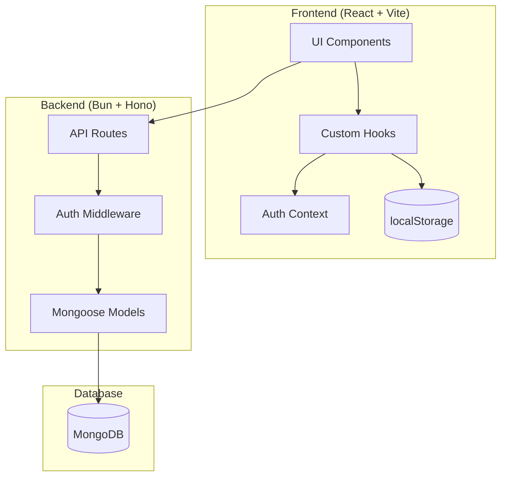
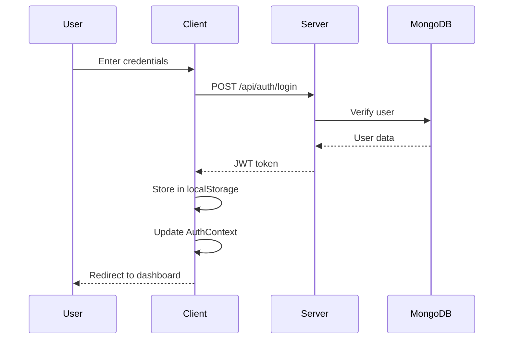
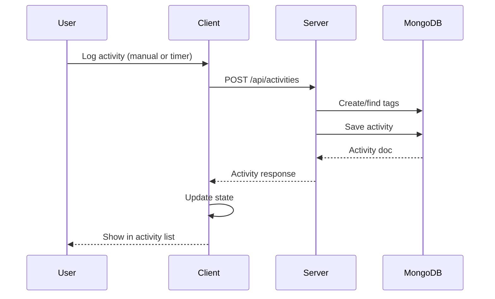
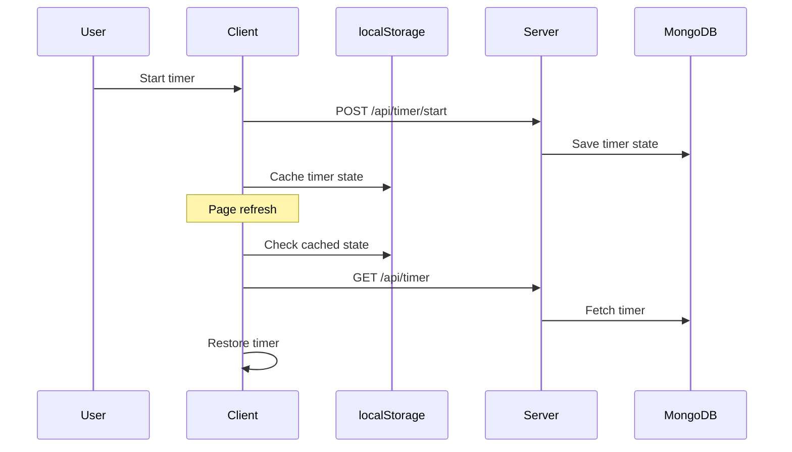

# Daytime Architecture Overview

A comprehensive guide to the Daytime time tracking application.

---

## Table of Contents

1. [System Architecture](#system-architecture)
2. [Technology Stack](#technology-stack)
3. [Project Structure](#project-structure)
4. [Data Flow](#data-flow)
5. [Component Guides](#component-guides)

---

## System Architecture



---

## Technology Stack

| Layer | Technology | Purpose |
|-------|------------|---------|
| **Runtime** | Bun.js | High-performance JavaScript runtime |
| **Backend** | Hono.js | Lightweight, fast web framework |
| **Frontend** | React 19 | Component-based UI library |
| **Build** | Vite | Fast dev server and bundler |
| **Database** | MongoDB | NoSQL document database |
| **ODM** | Mongoose | MongoDB object modeling |
| **Charts** | Recharts | React charting library |
| **Styling** | CSS Variables | Custom design system |

---

## Project Structure

```
daytime/
├── client/                    # Frontend application
│   ├── src/
│   │   ├── components/        # Reusable UI components
│   │   │   ├── ActivityList.jsx
│   │   │   ├── ActivityLogger.jsx
│   │   │   ├── CalendarView.jsx
│   │   │   ├── ConfirmDialog.jsx
│   │   │   ├── CreateTemplateModal.jsx
│   │   │   ├── SaveTemplateModal.jsx
│   │   │   ├── StatsView.jsx
│   │   │   ├── TemplateList.jsx
│   │   │   └── Timer.jsx
│   │   ├── context/           # React context providers
│   │   │   └── AuthContext.jsx
│   │   ├── hooks/             # Custom React hooks
│   │   │   └── useTimer.js
│   │   ├── pages/             # Route-level components
│   │   │   ├── Login.jsx
│   │   │   ├── Register.jsx
│   │   │   └── Visualization.jsx
│   │   ├── App.jsx            # Root component & routing
│   │   ├── config.js          # API URL configuration
│   │   ├── index.css          # Global styles
│   │   └── main.jsx           # Entry point
│   └── index.html
├── server/                    # Backend application
│   ├── models/                # Mongoose schemas
│   │   ├── Activity.ts
│   │   ├── Tag.ts
│   │   ├── Template.ts
│   │   ├── Timer.ts
│   │   └── User.ts
│   ├── routes/                # API route handlers
│   │   ├── activities.ts
│   │   ├── auth.ts
│   │   ├── tags.ts
│   │   ├── templates.ts
│   │   └── timer.ts
│   ├── middleware/            # Express-style middleware
│   │   └── auth.ts
│   └── index.ts               # Server entry point
├── docs/                      # Documentation
└── README.md
```


---

## Data Flow

### Authentication Flow



### Activity Logging Flow



### Timer Persistence Flow



---

## Component Guides

| Document | Description |
|----------|-------------|
| [Backend Architecture](./backend-architecture.md) | Server, routes, models, middleware |
| [Frontend Architecture](./frontend-architecture.md) | Components, hooks, state management |
| [API Reference](./api-reference.md) | All endpoints with request/response |
| [Data Models](./data-models.md) | Database schemas and relationships |
| [Design System](./design-system.md) | CSS variables, components, patterns |

---

## Key Design Decisions

### 1. Stateless JWT Authentication
- Tokens stored in localStorage for persistence
- Each request includes `Authorization: Bearer <token>` header
- Server validates JWT on every protected route

### 2. Timer Dual Persistence
- **localStorage**: Immediate persistence for page refresh survival
- **Server DB**: Long-term persistence and cross-device sync
- Hook reconciles both sources on page load

### 3. Tag Auto-Creation
- Categories are created on first use rather than pre-defined
- Random colors assigned automatically
- Enables frictionless activity logging

### 4. Component Composition
- Small, focused components (Timer, ActivityList, etc.)
- Shared state managed via props and context
- Custom hooks encapsulate complex logic (useTimer)
