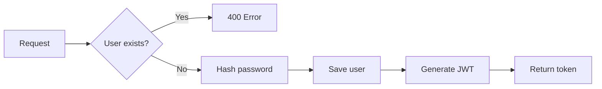
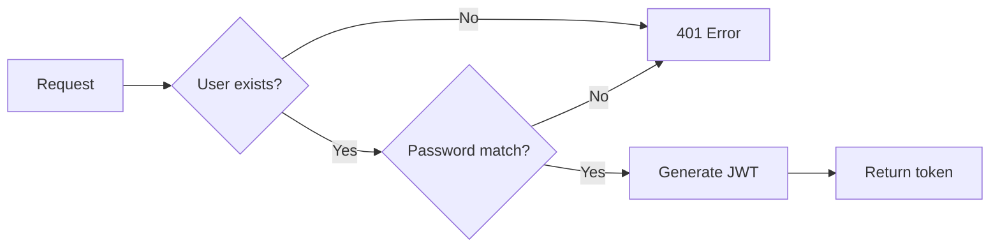
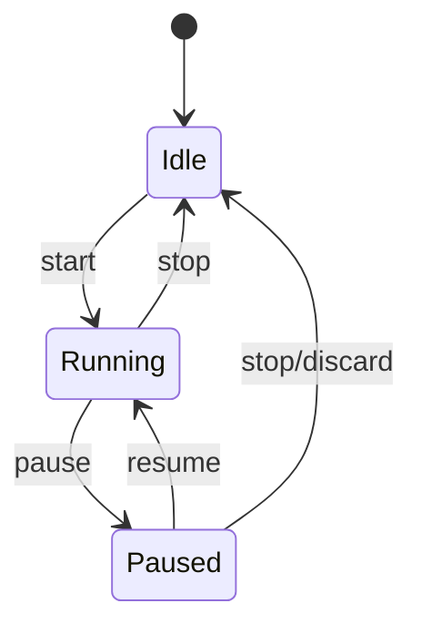

# Backend Architecture

The Daytime backend is built with Bun.js and Hono.js, providing a fast, type-safe API layer.

---

## Server Entry Point

**File**: `server/index.ts`

```typescript
// Initialization flow
1. Create Hono app
2. Apply CORS middleware
3. Connect to MongoDB
4. Mount route handlers
5. Export fetch handler for Bun
```

### CORS Configuration
All origins are allowed by default. In production, configure specific origins:
```typescript
app.use('/*', cors({ origin: 'https://yourdomain.com' }));
```

---

## Route Architecture

### Route Structure

All routes follow a consistent pattern:

```typescript
import { Hono } from 'hono';
import { authMiddleware } from '../middleware/auth';

const router = new Hono<{ Variables: { user: any } }>();
router.use('*', authMiddleware);  // Protected routes

router.get('/', async (c) => { /* handler */ });
router.post('/', async (c) => { /* handler */ });

export default router;
```

---

## Routes Detail

### Auth Routes (`/api/auth`)

| Endpoint | Method | Auth | Description |
|----------|--------|------|-------------|
| `/register` | POST | No | Create new user |
| `/login` | POST | No | Authenticate, return JWT |

**Register Flow:**


**Login Flow:**


---

### Activities Routes (`/api/activities`)

| Endpoint | Method | Auth | Description |
|----------|--------|------|-------------|
| `/` | GET | Yes | List user activities |
| `/` | POST | Yes | Create activity |
| `/:id` | DELETE | Yes | Delete activity |
| `/tags` | GET | Yes | List user tags |

**Create Activity Flow:**
1. Parse request body (description, durationMinutes, tagNames)
2. For each tagName:
   - Find existing tag OR create new with random color
3. Create Activity document with tag references
4. Populate tags and return

**Tag Auto-Creation:**
```typescript
for (const tagName of tagNames) {
    let tag = await Tag.findOne({ name: tagName, user: userId });
    if (!tag) {
        const randomColor = '#' + Math.floor(Math.random() * 16777215).toString(16);
        tag = new Tag({ name: tagName, user: userId, color: randomColor });
        await tag.save();
    }
    tagIds.push(tag._id);
}
```

---

### Timer Routes (`/api/timer`)

| Endpoint | Method | Auth | Description |
|----------|--------|------|-------------|
| `/` | GET | Yes | Get active timer state |
| `/` | PATCH | Yes | Update timer details |
| `/start` | POST | Yes | Start new timer |
| `/pause` | POST | Yes | Pause active timer |
| `/resume` | POST | Yes | Resume paused timer |
| `/stop` | POST | Yes | Stop timer, create activity |
| `/pomodoro/toggle` | POST | Yes | Toggle work/break |

**Timer State Machine:**


**Stop Timer Flow:**
1. Calculate elapsed time (accounting for pauses)
2. If `createActivity=true` and description exists:
   - Find/create tags
   - Create Activity document
3. Delete Timer document
4. Return result with activity

---

### Tags Routes (`/api/tags`)

| Endpoint | Method | Auth | Description |
|----------|--------|------|-------------|
| `/` | GET | Yes | List user tags |

Simple route returning all tags for the authenticated user.

---

### Templates Routes (`/api/templates`)

| Endpoint | Method | Auth | Description |
|----------|--------|------|-------------|
| `/` | GET | Yes | List user templates |
| `/` | POST | Yes | Create template |
| `/:id` | DELETE | Yes | Delete template |
| `/:id/use` | POST | Yes | Create activity from template |

**Create Activity from Template Flow:**
1. Find template by ID
2. For each tagName in template:
   - Find existing tag OR create new with random color
3. Create Activity document with current date
4. Populate tags and return

**Use Case:**
Templates allow users to quickly log recurring activities without re-entering details.

---

## Middleware

### Auth Middleware

**File**: `server/middleware/auth.ts`

```typescript
export const authMiddleware = async (c, next) => {
    // 1. Extract token from Authorization header
    const token = c.req.header('Authorization')?.split(' ')[1];
    
    // 2. Verify JWT
    const decoded = jwt.verify(token, SECRET);
    
    // 3. Attach user to context
    c.set('user', decoded);
    
    // 4. Continue to route handler
    await next();
};
```

**Context Variables:**
After auth middleware, route handlers access user via:
```typescript
const user = c.get('user');
// { id: string, username: string }
```

---

## Error Handling

### Response Patterns

**Success:**
```json
{ "data": {...}, "status": 200 }
```

**Error:**
```json
{ "error": "Error message", "status": 400|401|404|500 }
```

### Common Error Codes

| Code | Meaning |
|------|---------|
| 400 | Bad request / validation error |
| 401 | Unauthorized / invalid token |
| 404 | Resource not found |
| 500 | Server error |

---

## Database Connection

```typescript
const MONGODB_URI = process.env.MONGODB_URI || 'mongodb://localhost:27017/daytime';

mongoose.connect(MONGODB_URI)
    .then(() => console.log('Connected to MongoDB'))
    .catch((err) => console.error('MongoDB connection error:', err));
```

**Connection Options (production):**
- Use connection pooling
- Set appropriate timeouts
- Enable retry writes
