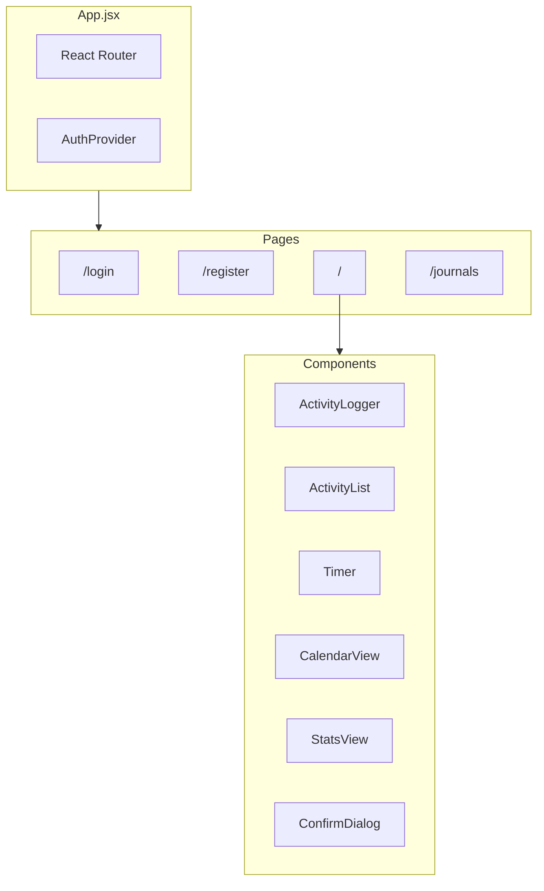
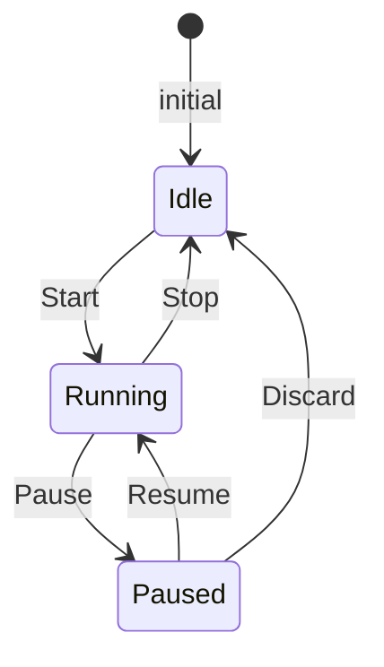
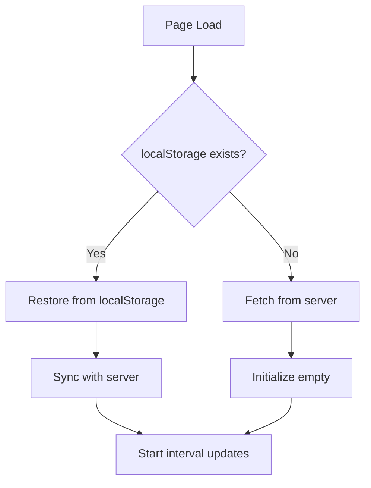

# Frontend Architecture

The Daytime frontend is a React 19 single-page application built with Vite.

---

## Application Structure



---

## Component Hierarchy

### Dashboard Page
```
Dashboard
├── ActivityLogger
│   ├── Timer (Timer Mode)
│   ├── Journal (Journal Mode)
│   └── Form (Manual Mode)
├── TemplateList
│   └── CreateTemplateModal
├── GoalProgress
│   └── GoalManager
├── CalendarView
├── AnalyticsCharts
│   ├── ActivityByDayChart
│   ├── CategoryDonutChart
│   └── ProductivityTrendsChart
└── ActivityList
    ├── SaveTemplateModal
    └── ConfirmDialog
```

### JournalList Page
```
JournalList
├── JournalCards
└── ConfirmDialog
```

---

## Core Components

### ActivityLogger

**File**: `components/ActivityLogger.jsx`

**Purpose**: Entry point for logging activities with triple modes.

**Props**:
| Prop | Type | Description |
|------|------|-------------|
| `onActivityLogged` | `() => void` | Callback when activity is created |
| `onJournalCreated` | `() => void` | Callback when journal is created |
| `selectedDate` | `string` | Pre-selected date (YYYY-MM-DD format) |
| `onDateChange` | `(date: string) => void` | Callback when date is changed |

**State**:
```javascript
{
  mode: 'manual' | 'timer' | 'journal',  // Current input mode
  description: string,                    // Activity description
  duration: string,                       // Duration in minutes
  tags: string,                           // Comma-separated categories
  localDate: string,                      // Selected date for entries
  availableTags: Tag[],                   // Fetched from API
  suggestions: Tag[]                      // Filtered suggestions
}
```

**Features**:
- Date picker above mode toggle (shared across all modes)
- Mode toggle between Manual Entry, Timer Mode, and Journal
- Tag autocomplete with color indicators
- Form validation

---

### Timer

**File**: `components/Timer.jsx`

**Purpose**: Real-time timer with Pomodoro support.

**Props**:
| Prop | Type | Description |
|------|------|-------------|
| `onActivityLogged` | `() => void` | Callback when timer stopped |
| `selectedDate` | `string` | Date to use for activity creation (YYYY-MM-DD) |

**Uses**: `useTimer` hook for all timer logic

**UI States**:


**Timer Display Classes**:
- `.timer-display` - Base styling
- `.timer-display.running` - Green border, pulse animation
- `.timer-display.paused` - Pink border

---

### Journal

**File**: `components/Journal.jsx`

**Purpose**: Journal entry form for note-taking.

**Props**:
| Prop | Type | Description |
|------|------|-------------|
| `onJournalCreated` | `() => void` | Callback when journal is saved |
| `selectedDate` | `string` | Date to attach to journal entry (YYYY-MM-DD) |

**State**:
```javascript
{
  content: string,          // Journal entry text
  category: string,         // Optional category
  loading: boolean,         // Submission state
  availableTags: Tag[],     // For category suggestions
  suggestions: Tag[]        // Filtered suggestions
}
```

**Features**:
- Multi-line textarea for journal content
- Optional category input with autocomplete
- Category suggestions from existing tags
- Form validation (requires content)

---

### ActivityList

**File**: `components/ActivityList.jsx`

**Purpose**: Display and manage activity entries.

**Props**:
| Prop | Type | Description |
|------|------|-------------|
| `activities` | `Activity[]` | Array of activities |
| `onActivityDeleted` | `(id: string) => void` | Delete callback |

**Features**:
- Activity cards with hover effects
- Delete button with confirmation
- Tags displayed with colors
- Duration badge

---

### TemplateList

**File**: `components/TemplateList.jsx`

**Purpose**: Display and manage activity templates.

**Props**:
| Prop | Type | Description |
|------|------|-------------|
| `onActivityCreated` | `() => void` | Callback when activity created from template |

**Features**:
- Grid display of saved templates
- "New Template" button opens CreateTemplateModal
- Use template button to create activity
- Delete button with confirmation

---

### CreateTemplateModal

**File**: `components/CreateTemplateModal.jsx`

**Purpose**: Modal for creating new templates from scratch.

**Props**:
| Prop | Type | Description |
|------|------|-------------|
| `isOpen` | `boolean` | Visibility state |
| `onClose` | `() => void` | Close handler |
| `onCreated` | `(template) => void` | Created callback |

**Features**:
- Form with name, description, duration, categories
- Category autocomplete with suggestions
- Uses React Portal for proper z-index layering

---

### SaveTemplateModal

**File**: `components/SaveTemplateModal.jsx`

**Purpose**: Modal for saving an existing activity as a template.

**Props**:
| Prop | Type | Description |
|------|------|-------------|
| `isOpen` | `boolean` | Visibility state |
| `onClose` | `() => void` | Close handler |
| `onSaved` | `(template) => void` | Saved callback |
| `activityData` | `object` | Activity to save as template |

**Features**:
- Pre-filled with activity data
- User provides template name
- Uses React Portal for proper z-index layering

---

### CalendarView

**File**: `components/CalendarView.jsx`

**Purpose**: Monthly calendar with activity indicators.

**Props**:
| Prop | Type | Description |
|------|------|-------------|
| `activities` | `Activity[]` | Activities to display |
| `onDayClick` | `(dateStr: string) => void` | Optional callback when clicking a day with activities |

**Features**:
- Month navigation
- Day cells with colored dots per activity
- Clickable days to filter dashboard charts by date
- Total minutes per day

---

### AnalyticsCharts

**File**: `components/AnalyticsCharts.jsx`

**Purpose**: Dashboard analytics charts using Recharts.

**Exported Components**:

#### ActivityByDayChart
| Prop | Type | Description |
|------|------|-------------|
| `activities` | `Activity[]` | Data for chart |
| `dateRange` | `{ start: string, end: string }` | Date range for x-axis |

Stacked bar chart showing hours per day with category breakdown.

#### CategoryDonutChart
| Prop | Type | Description |
|------|------|-------------|
| `activities` | `Activity[]` | Data for chart |
| `dateRange` | `{ start: string, end: string }` | Date range filter |

Donut/pie chart showing time distribution by category with percentage labels.

#### ProductivityTrendsChart
| Prop | Type | Description |
|------|------|-------------|
| `activities` | `Activity[]` | Data for chart |
| `dateRange` | `{ start: string, end: string }` | Date range for x-axis |

Stacked area chart showing activity patterns over time.

#### CategoryBreakdownChart
| Prop | Type | Description |
|------|------|-------------|
| `activities` | `Activity[]` | Data for chart |
| `dateRange` | `{ start: string, end: string }` | Date range for calculations |

Radial bar chart showing top 5 categories with summary stats (Total Hours, Daily Avg, Activity Count).

---

### ConfirmDialog

**File**: `components/ConfirmDialog.jsx`

**Purpose**: Modal confirmation for destructive actions.

**Props**:
| Prop | Type | Description |
|------|------|-------------|
| `open` | `boolean` | Visibility state |
| `title` | `string` | Dialog title |
| `message` | `string` | Confirmation message |
| `onConfirm` | `() => void` | Confirm action |
| `onCancel` | `() => void` | Cancel action |
| `loading` | `boolean` | Loading state |

**Features**:
- Overlay with blur backdrop
- Keyboard support (Escape to close)
- Loading indicator on confirm

---

### GoalProgress

**File**: `components/GoalProgress.jsx`

**Purpose**: Display and manage time-tracking goals with progress visualization.

**Props**:
| Prop | Type | Description |
|------|------|-------------|
| `activities` | `Activity[]` | Activities for deriving category colors |
| `onGoalUpdated` | `() => void` | Callback when goals are modified |

**Features**:
- Grid of goal cards with progress bars
- Category color indicators matching existing tags
- Streak badges (🔥) for consecutive periods of goal completion
- Daily/weekly period badges
- Edit and delete actions per goal
- "Add Goal" button opens GoalManager modal
- Auto-refresh when activities change

**Uses**: `useGoals` hook for state management

---

### GoalManager

**File**: `components/GoalManager.jsx`

**Purpose**: Modal for creating and editing goals.

**Props**:
| Prop | Type | Description |
|------|------|-------------|
| `isOpen` | `boolean` | Visibility state |
| `onClose` | `() => void` | Close handler |
| `onCreated` | `(goal) => void` | Created/updated callback |
| `existingGoal` | `Goal | null` | Goal to edit (null for create) |

**Features**:
- Category input with autocomplete suggestions from existing tags
- Hours/minutes time picker for target
- Period toggle (Daily / Weekly)
- Pre-fills data when editing existing goal
- Uses React Portal for proper z-index layering

---

## Custom Hooks

### useTimer

**File**: `hooks/useTimer.js`

**Purpose**: Encapsulates all timer logic including state, API calls, and persistence.

**Returns**:
```javascript
{
  // State
  active: boolean,
  description: string,
  tagNames: string[],
  isPaused: boolean,
  mode: 'timer' | 'pomodoro',
  pomodoroState: PomodoroState | null,
  elapsedMs: number,
  loading: boolean,
  error: string | null,

  // Actions
  startTimer: (description, tagNames, mode, pomodoroSettings) => Promise,
  pauseTimer: () => Promise,
  resumeTimer: () => Promise,
  stopTimer: (createActivity) => Promise,
  updateTimer: (description, tagNames) => Promise,
  togglePomodoro: () => Promise,

  // Utilities
  formatTime: (ms) => string,
  refresh: () => Promise
}
```

**Persistence Strategy**:


**Key Features**:
- Dual persistence (localStorage + server)
- 1-second update interval for running timer
- Automatic elapsed time calculation
- Pause duration tracking

---

### useGoals

**File**: `hooks/useGoals.js`

**Purpose**: Encapsulates goal state management and API operations.

**Returns**:
```javascript
{
  // State
  goals: Goal[],           // All user goals with progress
  loading: boolean,
  error: string | null,
  
  // Actions
  createGoal: (categoryName, targetMinutes, period) => Promise<{success, goal?, error?}>,
  updateGoal: (id, updates) => Promise<{success, goal?, error?}>,
  deleteGoal: (id) => Promise<{success, error?}>,
  refresh: () => Promise
}
```

**Key Features**:
- Auto-fetches goals on mount
- Progress and streak data included in goal objects
- Optimistic updates for state consistency

---

## Context Providers

### AuthContext

**File**: `context/AuthContext.jsx`

**Purpose**: Global authentication state.

**Value**:
```javascript
{
  user: { id, username } | null,
  loading: boolean,
  login: (token) => void,
  logout: () => void
}
```

**Implementation**:
- Reads JWT from localStorage on mount
- Decodes token to extract user info
- Provides login/logout actions

---

## Routing

**File**: `App.jsx`

```javascript
<Routes>
  <Route path="/login" element={<Login />} />
  <Route path="/register" element={<Register />} />
  <Route path="/journals" element={<PrivateRoute><JournalList /></PrivateRoute>} />
  <Route path="/" element={<PrivateRoute><Dashboard /></PrivateRoute>} />
</Routes>
```

**Pages**:
- `/login` - User authentication
- `/register` - New user registration  
- `/journals` - Journal entries list with date range filtering
- `/` - Main dashboard with activity logging, calendar, and analytics charts

**PrivateRoute**:
- Checks `AuthContext.user`
- Redirects to `/login` if not authenticated
- Shows loading state while checking

---

## State Management

### Local Component State
Most components use `useState` for local UI state.

### Shared State Patterns

1. **Prop Drilling**: Activities passed from Dashboard to children
2. **Callbacks**: `onActivityLogged`, `onActivityDeleted` bubble up
3. **Context**: AuthContext for global user state
4. **Custom Hooks**: useTimer encapsulates complex timer logic

### Data Refresh Pattern
```javascript
const [refreshTrigger, setRefreshTrigger] = useState(0);

// Force refetch
const triggerRefresh = () => setRefreshTrigger(c => c + 1);

// Effect runs on trigger change
useEffect(() => {
  fetchActivities();
}, [refreshTrigger]);
```

---

## API Integration

### Config
```javascript
// config.js
export const API_URL = 'http://localhost:3000/api';
```

### Fetch Pattern
```javascript
const token = localStorage.getItem('token');

const response = await fetch(`${API_URL}/endpoint`, {
  method: 'POST',
  headers: {
    'Content-Type': 'application/json',
    'Authorization': `Bearer ${token}`
  },
  body: JSON.stringify(data)
});

if (response.ok) {
  const result = await response.json();
  // Handle success
} else {
  // Handle error
}
```
