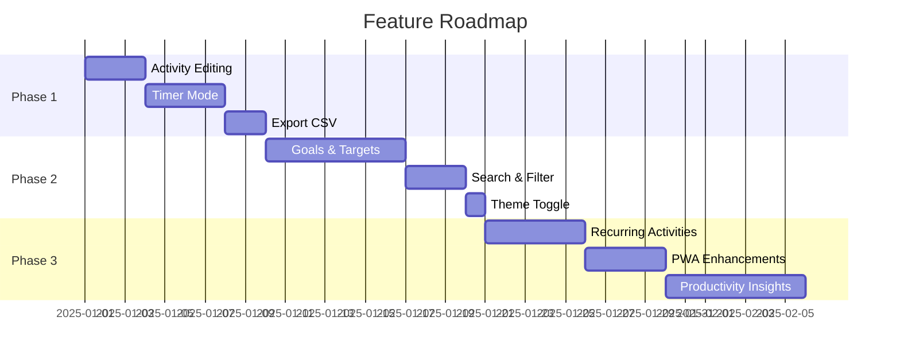

# Daytime - Feature Recommendations

> [!NOTE]
> These recommendations are prioritized by potential impact on user experience. Features are grouped by category with implementation complexity noted.

---

## 🎯 High-Impact Features

### 1. Recurring Activities / Templates
**Complexity**: Medium | **Impact**: High

Users often track similar activities daily (work, exercise, reading). Allow:
- Save activities as templates for quick re-logging
- Set up recurring activities that auto-populate
- One-click "repeat yesterday" for routine days

### 2. Goals & Targets ✅ IMPLEMENTED
**Complexity**: Medium | **Impact**: High

Enable users to set time goals per category:
- Daily/weekly targets (e.g., "8 hours work", "1 hour exercise")
- Visual progress indicators on dashboard
- Streak tracking for consistent habits

### 3. Timer / Stopwatch Mode
**Complexity**: Low-Medium | **Impact**: High

Instead of manually entering duration:
- Start/stop timer for real-time tracking
- Pause/resume capability
- Background timer that persists across page refreshes
- Optional: Pomodoro technique integration

---

## 📊 Analytics Enhancements

### 4. Productivity Insights
**Complexity**: Medium | **Impact**: Medium-High

AI-powered or algorithmic insights:
- "Most productive day of the week"
- "Average time per category comparison"
- Week-over-week trend analysis
- Personalized recommendations ("You're 20% more productive on Mondays")

### 5. Export & Reporting
**Complexity**: Low | **Impact**: Medium

- Export data to CSV/PDF
- Weekly/monthly email summary reports
- Shareable analytics links (anonymized)
- Integration with calendars (export to .ics)

### 6. Comparison Views
**Complexity**: Medium | **Impact**: Medium

- Compare weeks/months side by side
- Category breakdown comparisons over time
- "This week vs last week" quick view

---

## 🎨 UX Improvements

### 7. Quick Entry Shortcuts
**Complexity**: Low | **Impact**: High

- Keyboard shortcuts for common actions (Cmd+N for new activity)
- Quick-add floating button on mobile
- Natural language input: "30 min reading today" auto-parses

### 8. Drag-and-Drop Editing
**Complexity**: Medium | **Impact**: Medium

- Reorder activities by dragging
- Drag on calendar to reschedule activities
- Resize activity blocks to adjust duration

### 9. Dark/Light Theme Toggle
**Complexity**: Low | **Impact**: Medium

- User preference for light mode (currently dark-only)
- System preference detection
- Persisted preference in user settings

### 10. Mobile PWA Enhancements
**Complexity**: Low-Medium | **Impact**: High

- Install as PWA with offline support
- Push notifications for reminders
- Pull-to-refresh gestures
- Native-feeling transitions

---

## 🔗 Integrations

### 11. Calendar Sync
**Complexity**: High | **Impact**: High

- Two-way sync with Google Calendar/Outlook
- Auto-import calendar events as activities
- Block time on external calendars

### 12. Browser Extension
**Complexity**: Medium-High | **Impact**: Medium

- Quick-log from any tab
- Automatic website time tracking
- "What are you working on?" prompts

### 13. API & Webhooks
**Complexity**: Medium | **Impact**: Low-Medium

- Public API for third-party integrations
- Webhooks for automation (Zapier, IFTTT)
- Import from other time tracking tools

---

## 👥 Social & Collaboration

### 14. Shared Categories (Teams)
**Complexity**: High | **Impact**: Medium

- Share categories across team members
- Team dashboards for collaborative projects
- Compare productivity with peers (opt-in)

### 15. Accountability Partners
**Complexity**: Medium | **Impact**: Medium

- Invite a friend to view your progress
- Joint goal setting
- Celebratory notifications for achievements

---

## 🔧 Quality-of-Life Features

### 16. Activity Editing
**Complexity**: Low | **Impact**: High

- Edit existing activities (description, duration, category)
- Bulk edit/delete multiple activities
- Undo recent actions

### 17. Activity Notes & Attachments
**Complexity**: Low-Medium | **Impact**: Medium

- Add notes/descriptions to activities
- Attach files or links
- Rich text support for journaling

### 18. Search & Filter
**Complexity**: Low | **Impact**: Medium

- Full-text search across activities
- Filter by category, date range, duration
- Saved filter presets

### 19. Weekly/Daily Summary View
**Complexity**: Low | **Impact**: Medium

- Condensed summary cards
- "Today at a glance" widget
- Weekly report view distinct from calendar

### 20. Customizable Dashboard
**Complexity**: Medium | **Impact**: Medium

- Drag-and-drop dashboard widgets
- Choose which charts/stats to display
- Collapsible sections

---

## 🚀 Recommended Quick Wins

| Feature | Effort | Impact | Priority |
|---------|--------|--------|----------|
| Timer Mode | 2-3 days | High | ⭐⭐⭐ |
| Activity Editing | 1-2 days | High | ⭐⭐⭐ |
| Export to CSV | 1 day | Medium | ⭐⭐⭐ |
| Search & Filter | 1-2 days | Medium | ⭐⭐ |
| Theme Toggle | 0.5 days | Medium | ⭐⭐ |
| Keyboard Shortcuts | 1 day | Medium | ⭐⭐ |

---

## 📈 Suggested Roadmap

---

> [!TIP]
> Start with **Phase 1** quick wins to immediately improve daily usability, then build toward the goal-tracking and insights features that provide long-term engagement value.
